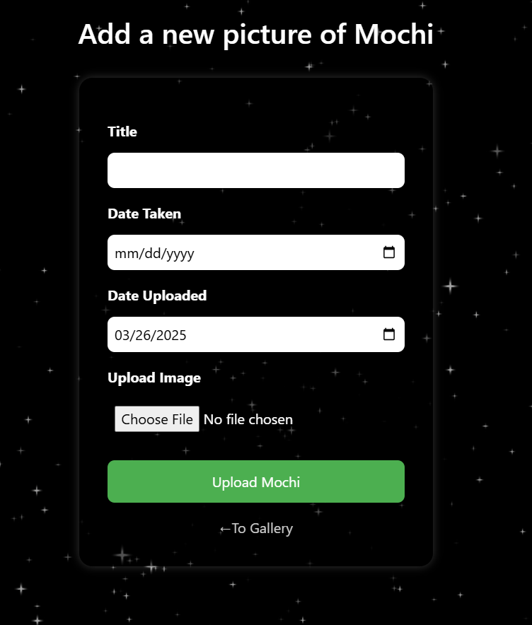
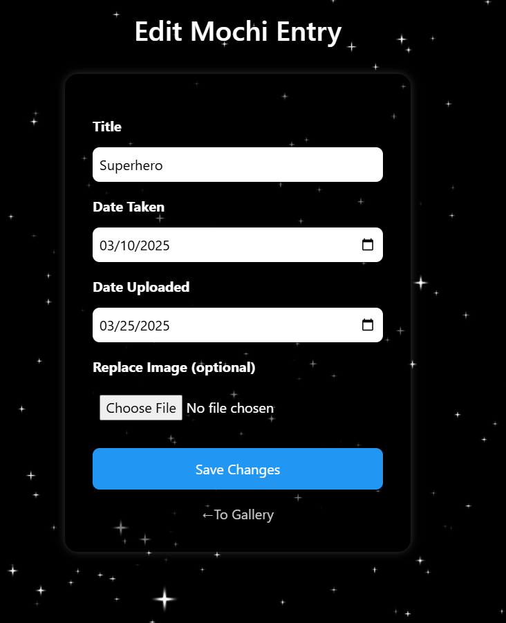
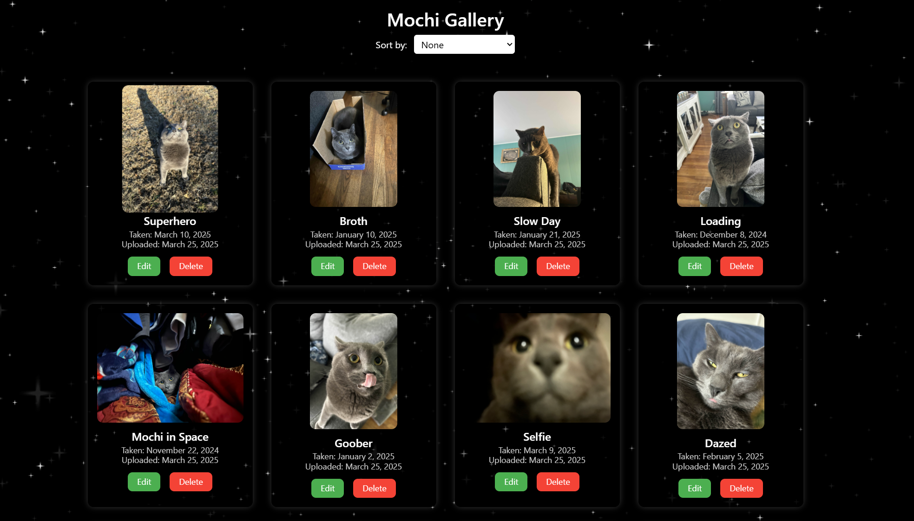

## About Mochi-Log

**Mochi-Log** is a personal photo logging web application made to catalog and view images of my cat Mochi. It supports full CRUD functionality with authentication-restricted access, designed using ASP.NET Core and Entity Framework Core with an SQLite database.

---

## Live Demo

🔗: [mochi-log.onrender.com](https://mochi-log.onrender.com)

_Note: CRUD actions (Add/Edit/Delete) require login via a hidden route._

---

## Features

- View logged images in a responsive gallery
- Sort by title, date taken, or upload date
- Add, edit, and delete images (admin only)
- Images are stored directly in the database as binary
- Authentication restricted to a single admin account via environment variables

---

## Admin Interface

> These features are **only accessible when logged in as an admin user**.

### Add Page

### Edit Page

### Gallery with Edit/Delete Buttons

---

## Tech Stack

- ASP.NET Core (.NET 8)
- Entity Framework Core
- SQLite
- Razor Pages & MVC
- Docker (for deployment)
- Render (cloud hosting)

---

## Deployment

The app is containerized using Docker and deployed on [Render](https://render.com).  
The SQLite database is bundled in the Docker image and persists across restarts unless the container is rebuilt.

---
